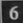
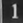

# AR-Sudoku-Solver

A augmented reality sudoku solver using random forest classifier and backtracking algorithm

# Description
1.Building the dataset

For building the dataset the same program is used which is used for capturing the square grids during solving.

Installation

`pip install opencv-python`

By this method we are capturing 23 by 23 size grayscale images. There are 529 features, upon which the classifier will be trained.

Sample training images -   

